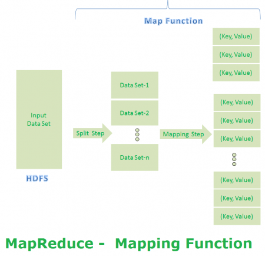
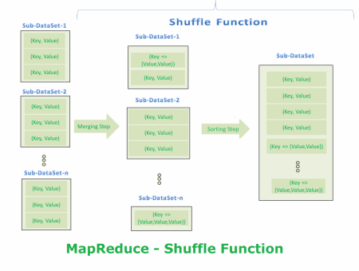
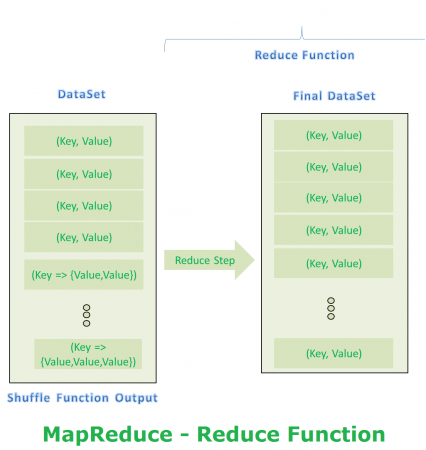

# Assignment3 - Introduction to MapReduce Algorithm

Welcome!

This is your chance to make your hands dirty with map reduce algorithm.

In this assignment you will work with a large dataset. We have a dataset of size 1.6 GB (compressed, and 12 GB when uncompressed), with the records of nearly 120 million records. Below, find a general overview about [the map-reduce algorithm and concepts](#introductory-knowledge-on-concepts) and some instructions to setup your assignment. Following this guide will be benefical for you to cope with the assignment.

The goal of this assignment is to bring you face-to-face with problems and troubles in the case of a large dataset. The challanges of working a dataset that is larger than your computer RAM brings some serious problems that you may not able to solve, unless you use parallel programming, or big data algorithms. [MapReduce](https://research.google/pubs/pub62/) is one of those algorithms to help you overcome problems.

## Introductory Knowledge on Concepts

### What is MapReduce

[MapReduce](https://en.wikipedia.org/wiki/MapReduce) is a processing technique and a program model for distributed computing.

The MapReduce algorithm contains two important tasks, namely Map and Reduce. Map takes a set of data and converts it into another set of data, where individual elements are broken down into tuples (key/value pairs). Secondly, reduce task, which takes the output from a map as an input and combines those data tuples into a smaller set of tuples. As the sequence of the name MapReduce implies, the reduce task is always performed after the map job.

The major advantage of MapReduce is that it is easy to scale data processing over multiple computing nodes. Under the MapReduce model, the data processing primitives are called *mappers* and *reducers*. 

Decomposing a data processing application into mappers and reducers is sometimes nontrivial. But, once we write an application in the MapReduce form, **scaling** the application to run **over hundreds, thousands, or even tens of thousands of machines** in a cluster is merely a configuration change.

MapReduce Algorithm uses the following three main steps:

1. Map Function
2. Shuffle Function
3. Reduce Function

### 1. Map

Map function takes the task and divides it into subtasks. It may have two substeps under mapping:

1. Splitting 
2. Mapping

In splitting, the data is divided into sub-datasets.
In mapping, each of the sub-datasets are used in performing a required action or computation on each dataset.

The output of the mapping function should be a <key, value> pairs.

### 2. Shuffling

Shuffling is the step where each <key, value> pairs are performed on ordering. It has two substeps:

1. Merging
2. Sorting

Merging combines all keys together and puts the same key's values into a list.
Sorting is the substep where the values are sorted per key.

The output of the shuffling is <key, sorted(value)> pairs. 

### 3. Reduce

Reduce is the action of reducing the sorted values into a value using the required action or computation.

As a result, all <key, sorted(value)> pairs are returned back to <key, value> pairs with performed calculation.

### About the Dataset

The data consists of flight arrival and departure details for all commercial flights within the USA, from October 1987 to April 2008.

Each row represents an individual flight record with details of that flight in the row. The information are:

- Time and date of arrival
- Originating and destination of airports
- Amount of time for a plane from taxi to takeoff

You can find more information about this dataset in the website of [Statistical Computing](http://stat-computing.org/dataexpo/2009/).

## Tasks

The quest is very simple:

> Find the # of flights each airline made so far, for the period of 1987 to 2008.

The problem we are trying to solve is very simple, however, with an iterative approach, it may be hard to find the solution because of that size of the dataset.

Your task is to use MapReduce and implement on airlines dataset and take advantage of this algorithm to solve the quest.

As always, I made the **"hardest part"** :smile:, used the iterative approach to find the solution. And as you will see in the notebook, when you run it, it takes quite a lot of time.

Following is the list of your, tasks.

### Setup

Follow below instructions to set up your assignment repository.

- [ ] Download images from [My Google Drive](https://drive.google.com/open?id=1145wIkSlzA61CdHS4hZZFgF6ZzIbaVJM). (Only SPU emails are allowed to download.)
- [ ] Create a folder named as `data` in this directory. Put the data files in this folder.
- [ ] Run `Assignment3.ipynb`.
- [ ] Load the entire dataset into a DataFrame.

### EDA

Do the following tasks using at least 30M rows.

- [ ] Create a new field of timestamp using the columns `Year`, `Month`, `DayofMonth`, `DayOfWeek`, `DepTime`, and `CRSDepTime`. Note that `CRSDepTime` is in `HHMM` format.
- [ ] How many rows does you dataset have?
- [ ] How many flights that are not cancelled were taken?
- [ ] What is the average departure delay from each airport?
- [ ] What day the delays are the worst?

### MapReduce

Use map-reduce algorithm to find out the results of the following questions.

- [ ] Find the counts of all airlines using MapReduce algorithm.
- [ ] Find the mean departure delay per origination airport.

## What are All These Files?

Following table is will give it a meaning for each file.

File                | Description 
-------             | ----------- 
README.md           | A descriptive file to give an introduction of current project/ assignment. Includes a todo list that **you have to edit**.
LICENCE             | The licence of the file that every project should have.
.gitignore          | The file to control which files should be ignored by Git.
.gitkeep            | An empty file to keep folders under git.
requirements.txt    | A list of python packages you may need for the assignment.
Assignment3.ipynb   | Sample notebook as a reference for how your notebooks should be organized.
data_handler.py     | Module that has helper functions to do HW related tasks, all serial way.
utils.py            | Utility module that has common functions.

## Your To-Do List for This Assignment

- [ ] I **have completed** all the tasks in [tasks](#tasks) section.
- [ ] I edit this README file and checkmarked things I've completed in the tasks section.
- [ ] My notebook(s) are well organized with headings, comments, that makes it visually appealing.
- [ ] My notebook(s) have the results of my execution.
- [ ] My notebook(s) are reproducible.
- [ ] I download the final version of my repository, and uploaded to the [blackboard](https://saintpeters.blackboard.com/)!
